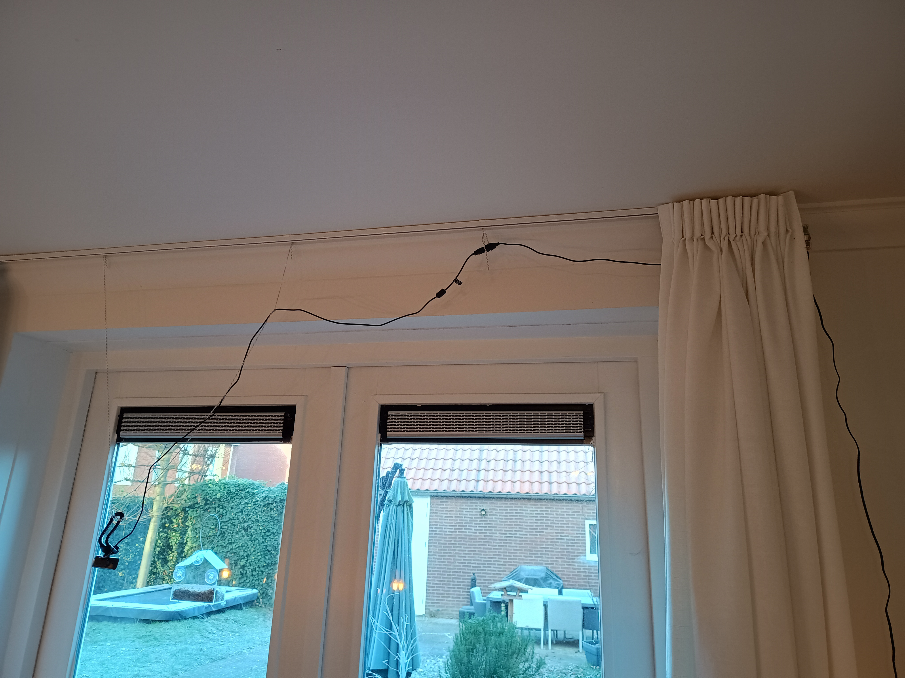

# Context

This repo is related to a linkedin [post](https://www.linkedin.com/posts/andreaswombacher_ai-imageprocessing-ml-activity-7416793655799078913-KedQ?utm_source=share&utm_medium=member_desktop&rcm=ACoAAAAV3PkBGnA_9CALg58xJHHnop6AJFyJr8E) about a Christmas project with my son to detect birds in a bird house mounted to a glas door to the garden and storing the images. The project was using a simple web cam and a Raspberry PI 3.

In this repo, I share the code and explain the process on how you can replicate the setup in your garden ;-) Enjoy!

I was able to collect images, which I then turned into a video again:

<video width="500" controls>
  <source src="https://dms.licdn.com/playlist/vid/v2/D4E05AQG8Oqlj82KBCA/mp4-720p-30fp-crf28/B4EZu2.hbbKcCM-/0/1768301403876?e=1769533200&v=beta&t=9aNf6FdDRCoz75MZMCquKiuNUrOmd4Uxu3cVpnpbVfk" type="video/mp4">
  Your browser does not support the video tag.
</video>


# Hardware

I was using a Raspberry PI 3 with a 32GB SD card. A simple USB based Web Cam which was able to provide images in 640*480 pixels.
Further, we used a plexiglas bird house for a few EURs from Action, which is a chain in the Netherlands and other parts of the world.
I am sure you can find a similar bird house online.


# Basic Setup

The basic setup was very temporary ;-)



The bird house was mounted to the door on the outside and the camera was attached with strings to the curtain rails inside. The Raspberry PI was attached also to the curtain rail using a rubber band.
The disadvantage of this setup was that closing and opening the curtain moved the camera and also resulted in a change of the position relative to the bird house.


# Configuration of the Raspberry PI

The Raspberry PI was setup as a web server running a Apache HTTPD service. 
Further, a python file was running in deamon mode to read the camera images, :
 - detect movement and store the images, or later on
 - detect movement, check whether the image shows a bird and then store the image and report the timestamp in a csv file.

The stored files are stored in the directory /var/www/html/ directory, which is the default content directory of the web server.
To be able to see the files, the /var/www/html/index.html file has to be removed, such that the content of the directory is visible.

To check the quality of the detected birds in the second case I created a folder /var/www/html/non/ where all images of movements are stored, which are NOT showing a bird.

To ensure that the python program can write to the volder /var/www/html/ and /var/www/html/non/ perform the following commands:

```bash
sudo chmod o+w /var/www/html/
sudo chmod o+w /var/www/html/non/
```

To work easily with the repo on the Raspberry PI clone the repo on the Raspberry PI.
```bash
git clone https://github.com/aureliusenterprise/bird_image_recognition.git
```


start on raspberry pi with

```
nohup ./start_video_detection.bsh > job.log 2>&1 &
```


Post process images to have the right settings for linkedin.

ffmpeg -i output_video2.mp4 -c:v libx264 -profile:v baseline -level 4.2 -pix_fmt yuv420p -movflags +faststart -c:a aac -b:a 128k output_linkedin2.mp4
