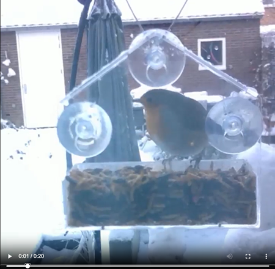

# Context

This repo is related to a linkedin [post](https://www.linkedin.com/posts/andreaswombacher_ai-imageprocessing-ml-activity-7416793655799078913-KedQ?utm_source=share&utm_medium=member_desktop&rcm=ACoAAAAV3PkBGnA_9CALg58xJHHnop6AJFyJr8E) about a Christmas project with my son to detect birds in a bird house mounted to a glas door to the garden and storing the images. The project was using a simple web cam and a Raspberry PI 3.

In this repo, I share the code and explain the process on how you can replicate the setup in your garden ;-) Enjoy!

I was able to collect images, which I then turned into a video again:

[](https://dms.licdn.com/playlist/vid/v2/D4E05AQG8Oqlj82KBCA/mp4-720p-30fp-crf28/B4EZu2.hbbKcCM-/0/1768301403876?e=1769533200&v=beta&t=9aNf6FdDRCoz75MZMCquKiuNUrOmd4Uxu3cVpnpbVfk)


# Hardware

I was using a Raspberry PI 3 with a 32GB SD card. A simple USB based Web Cam which was able to provide images in 640*480 pixels.
Further, we used a plexiglas bird house for a few EURs from Action, which is a chain in the Netherlands and other parts of the world.
I am sure you can find a similar bird house online.


# Basic Setup

The basic setup was very temporary ;-)


The bird house was mounted to the door on the outside and the camera was attached with strings to the curtain rails inside. The Raspberry PI was attached also to the curtain rail using a rubber band.
The disadvantage of this setup was that closing and opening the curtain moved the camera and also resulted in a change of the position relative to the bird house.


# Configuration of the Raspberry PI

The Raspberry PI was setup as a web server running a Apache HTTPD service. 
Further, a python file was running in deamon mode to read the camera images, :
 - detect movement and store the images, or later on
 - detect movement, check whether the image shows a bird and then store the image and report the timestamp in a csv file.

The stored files are stored in the directory /var/www/html/ directory, which is the default content directory of the web server.
To be able to see the files, the /var/www/html/index.html file has to be removed, such that the content of the directory is visible.

To check the quality of the detected birds in the second case I created a folder /var/www/html/non/ where all images of movements are stored, which are NOT showing a bird.

To ensure that the python program can write to the volder /var/www/html/ and /var/www/html/non/ perform the following commands:

```bash
sudo chmod o+w /var/www/html/
sudo chmod o+w /var/www/html/non/
```

To work easily with the repo on the Raspberry PI clone the repo on the Raspberry PI.
```bash
git clone https://github.com/aureliusenterprise/bird_image_recognition.git
```


# Overall approach

The overall approach is following a classicial machien learning approach:
 - collect an intitial dataset as a basis to train a model
 - annotate the data manually and create a training dataset
 - Train the model using a pre-trained model
 - deploy the trained model to the Raspberry PI and start the bird detection

Some important points:
 - Basemodel is based on a 160*160 images, thus make sure that the images in the training dataset are resized to this size or at least are quadratic. Otherwise the resizing will distort the image significantly reducing the benefit of a pre-trained model. 
 - Basemodel is pretrained with 1000 classes including birds.
 - Model is working well with different light conditions
 - Having all kinds of preprocessing (cropping & resizing) in the model resulted in problems doing the GradCAM to evaluate wrong positives and false negatives afterwards. Thus, these operations were applied before the model is applied.
 - I share the model I have used as a transformer in ```bird_classifier_int8.tflite```.


# Step by step 

In this section I will provide some more details on what the different code part do and how they are called. 

## Collect data to create a trainings dataset
In the folder 01_detect_changes are 2 files. The file detected_changes.py connects to the camera, looks for changes in a frame. If the area of a change is greater than 1000 then the frame is stored as a file with a running number in folder ```/var/www/html/```.

This script has to be executed on the Raspberry PI. The python file can be run on the Raspberry PI in the background by executing on the Raspberry PI the following command in the directory where the repo has been cloned to.

```bash
nohup ./start_video_detection.bsh > job.log 2>&1 &
```


## Create dataset

The file '''post_process_images.py''' can be run on your laptop to download all files from the Raspberry PI as a basis to construct a dataset for training the model. 

## Train the model

The next step is to annotate the downloaded images and classify them as showing a bird or not showing a bird.
The annotated images can be used to create a training and validation dataset. The required directory structure is

 - dataset
   - training
     - 0_non_bird
     - 1_bird
   - validate
     - 0_non_bird
     - 1_bird

In these directories the individual files are stored.

Then the training can be performed using the script ```train_bird_classifier_v2.py```. The training results in a file ```bird_classifier_int8.tflite``` which is the data required by the transformer. The file I have trained is included in the root directory of this repo.


## Detect birds with a trained model

The file ```bird_classifier_int8.tflite``` has to be transfered to the Raspberry PI. 
The detection of the birds requires that a web cam is connected otherwise the script will fail.
Thge detection can be started from the root directory of this repo on the Raspberry PI with the command below:

```
nohup ./start_bird_detection.bsh > job.log 2>&1 &
```

The script uses the file ```bird_cam_v2.py```. 


## Debugging

In some cases and during development I wanted to investigate why I had false positive and false negative image detection. For that purpuse the debugging directory. There are two scripts: 
 - ```check_score_for_image.py``` downloads a file from the Raspberry PI and applies the model and return the result of the m odel
 - ```gradcam_test.py``` reads a file from a local directory and indicates which part of the image was most influential on the decision to classify the image.


# Post processing

For publishing a video it is necessary to transform the video into a specific format. The video must have a square format and a certain schema of the mp4 file. The rigth settings can be created with the following command, which can be executed in the WSL.

```ffmpeg -i output_video2.mp4 -c:v libx264 -profile:v baseline -level 4.2 -pix_fmt yuv420p -movflags +faststart -c:a aac -b:a 128k output_linkedin2.mp4```


Feel free to send me some feedback!
